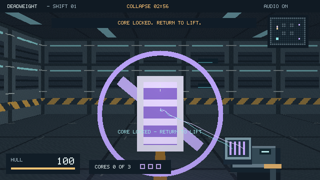

# DEADWEIGHT — SHIFT 01

A small native Linux magnetic salvage FPS. One room, three cores, three
security drones and a three-minute contract. Everything you see and hear is
generated by the executable. Built with Antoni Norman / Pingu's C Optimizer.

**Current packed executable: 15,132 bytes (14.8 KiB).** The regular native
executable is 58,144 bytes. These figures exclude shared system libraries;
the source, documentation and captured evidence make the repository larger.



[Watch or download the playthrough with sound](evidence/victory/playthrough.mp4)
· [Browse the C source](DEADWEIGHT.c) · [Read the test results](E2E.md)

## Credits

Game implementation, procedural score and test harness created by OpenAI Codex
for Antoni “Pingu” Norman using his
[C Optimizer toolkit](https://github.com/pinguy/c_optimizer) and its examples.
Antoni supplied the toolkit, set the challenge, play-tested the result and
reported the performance issue that led to this build.

ECHOHULL supplied the adapted bitmap font and informed collision and dynamic
SDL loading. NERVK and VOIDRUNNER informed the game loop and layered audio.
See [NOTICE](NOTICE) for the attribution details. The game is Apache-2.0;
the bundled, unmodified toolkit files retain their MIT licence.

## How the music fits

The soundtrack is synthesized in `audio_frame()` in [DEADWEIGHT.c](DEADWEIGHT.c).
It stores four root notes, a 16-step arpeggio pattern and the code that makes
the instruments. At 108 BPM, those patterns drive a triangle-wave bass,
sine-wave arpeggios and minor chords. Swept sine waves and shaped noise make
the kick, snare and hats. Stereo panning and a cross-delay add space; nearby
drones add an extra kick to the rhythm. Sound effects use the same mixer.

The engine generates 48 kHz, 16-bit stereo samples during play. There is no
embedded song recording or sample bank. Delay buffers are allocated in memory,
and the executable compresses the synth code and patterns alongside the game
using the toolkit's stripping and BCJ/LZMA packing. That saves disk space at the
cost of doing the synthesis at runtime. The MP4 is a separate recording for
inspection and is not needed to play.

## Performance update

This build removes repeated wall/effect calculations and skips floor pixels
hidden by walls. The game still draws at 640×360. Desktop output now requests
SDL acceleration for scaling/presentation and falls back to software; use
`sh run.sh --software` to select the fallback explicitly.

Simulation uses a real-time accumulator. Audio follows the device's playback
queue independently, so a slower drawing frame no longer slows the mission
or starves music by producing only one frame of samples. The soundtrack itself
is unchanged: the same recorded input sequence produced byte-identical PCM.

For a five-second check on your actual desktop:

```sh
sh run.sh --benchmark 5
```

It starts the room, measures rendering and simulation timing, prints one JSON
result with the SDL renderer, display driver and audio queue status, then exits.
`audio_queue_empty_events` counts observed empty software queues; it is not a
measurement taken from physical speakers. A normal run should keep it at zero.

## Play

Clone the repository or download and extract its ZIP, then run from the game folder:

```sh
sh run.sh
```

`run.sh` starts the regular native executable. The tiny packed version is also
included; run it with `sh deadweight`. Both contain the same game.

The supplied binaries target **Linux x86_64 with glibc 2.38 or newer** and need
the SDL2 runtime (`libSDL2-2.0.so.0`). They were built on Ubuntu 24.04 with GCC
13.3. The raycaster runs on the CPU, while SDL can use the GPU for display scaling.
The software fallback needs no OpenGL setup. No external asset files are needed. Audio failure falls back to silent play.

The packed runner additionally uses `xz` and extracts its payload into `/tmp`.
If `/tmp` is mounted `noexec`, use the regular executable through `run.sh`.
If the supplied native binary is incompatible with your system, rebuild it
locally with `sh build.sh native`.

## Your job

Bring the **three violet reactor cores** to the cyan lift where you start.
The small scanner shows core positions, the lift and your heading. A core
banks automatically inside the lift ring and repairs 18 hull points.

Aim at metal and pull it into the magnetic field. A held object slows movement
and occupies the view. Steel plates make effective projectiles: fling one into
a drone to scrap it. Dropped and thrown cores remain recoverable. A clear line
of sight is needed to pull something.

You win when all three cores are banked. Zero hull or the three-minute station
collapse ends the shift. The layout is fixed so you can learn a route.

| Input | Action |
| --- | --- |
| Enter | Start / restart after a win or death |
| WASD | Move and strafe |
| Mouse | Turn |
| Q / E | Turn without a mouse |
| Left click | Pull an aimed object / throw the held object |
| F | Pull / drop |
| Right click | Drop |
| Shift | Sprint |
| Escape | Pause / resume; quit from title or results |
| M | Mute / unmute |
| F11 | Toggle desktop fullscreen |
| Window close | Quit |

## Build

The source is one C translation unit. A normal build needs a C compiler,
standard development headers and libm/libdl. SDL2 is loaded dynamically, so
SDL development headers are unnecessary.

```sh
sh build.sh native
sh build.sh packed
```

The second command uses the included, unmodified C Optimizer build script,
syscall entry point, section stripper and BCJ/LZMA parameter sweep. It needs
GCC supporting `-Oz`, binutils, Python 3 and xz. On an older GCC that lacks
`-Oz`, try `COPT_OPT=-Os sh build.sh packed`. Binary size varies by toolchain.

## Reproduce the end-to-end checks

```sh
python3 tests/e2e.py ./deadweight-native --out my-check
python3 tests/e2e.py ./deadweight-native --failure-only --out my-failure-check
python3 tests/e2e.py ./deadweight --record --out my-recording
python3 tests/performance.py ./deadweight-native --out my-performance.json
```

Python 3 and the SDL2 runtime are sufficient for the checks. Pillow optionally
converts captures to PNG. `--record` also needs ffmpeg and writes a playthrough
with sound. Without Pillow, the original PPM screenshots remain usable.

The harness starts the **actual executable**, sends keyboard and mouse events
through `SDL_PushEvent`, and lets its normal event loop, collision, cargo,
projectiles, enemies and mission rules run. The controller reads telemetry to
aim and navigate. It never sets positions, health, scores or win states.

Headless testing uses SDL's dummy display and audio drivers, the real software
renderer, and a fixed 60 Hz simulation. Screenshots/video come from
`SDL_RenderReadPixels`; the soundtrack recording contains the same PCM samples
sent through the same synthesizer used for live SDL playback. Live playback
fills the audio queue according to device demand; the deterministic test
generates one sample block per simulation step. The test does not verify a physical keyboard, speakers, mouse
capture, fullscreen or desktop integration on your particular machine.

The test protocol is deliberately explicit: `step FRAMES KEYMASK MOUSE_DX
BUTTONMASK` creates SDL input events; `shot NAME` captures a frame. Complete
commands and read-only traces from the delivered build are in `evidence/`.
`--seed N` controls particles, not level generation.

`tests/performance.py` times three reproducible views and exercises the normal
real-time loop both at its usual frame rate and with an extra 40 ms drawing
delay. An optional `--baseline /path/to/old-executable` compares both versions
on the same host. The delay option is available only with `--benchmark`.

See `E2E.md` for the recorded results and `NOTICE` for source credits.

## Scope

This is a short playable prototype: one fixed arena, one tool, one drone type,
no saving or campaign. Drones chase when they have line of sight; they do not
plan routes around columns. The framebuffer is 640×360, scaled to the window.
The 108 BPM stereo score combines a bass pattern, minor-key arpeggios, pads,
breakbeat percussion and cross-delay, with separate magnetic, impact, damage
and delivery sounds.

Implementation references: [SDL renderer selection](https://wiki.libsdl.org/SDL2/SDL_CreateRenderer),
[renderer information](https://wiki.libsdl.org/SDL2/SDL_GetRendererInfo), and
[high-resolution timing](https://wiki.libsdl.org/SDL2/SDL_GetPerformanceCounter).
